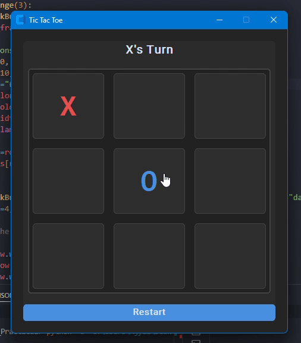

# 🎮 Tic-Tac-Toe AI Game (Minimax with Alpha-Beta Pruning)


This project is a Python implementation of the classic **Tic-Tac-Toe** game featuring:
- An intelligent AI opponent using the **Minimax algorithm with Alpha-Beta pruning**.
- A modern **GUI interface built with `customtkinter`**.


## 🎥 Demo



## 🏆 Game Description

- 2 players: Human (`'X'`) vs AI (`'O'`)
- 3x3 grid board
- The AI uses the Minimax algorithm to simulate all possible outcomes and picks the best move.
- Alpha-Beta pruning is used to optimize performance by reducing the number of evaluated game states.

## 🧠 AI Strategy

- **Minimax Algorithm**: Recursively explores all possible moves to find the best outcome.
- **Alpha-Beta Pruning**: Skips evaluating branches that won't affect the final decision, making the AI faster.

### Evaluation Scores:
- AI (`'O'`) wins: `+1  depth`
- Human (`'X'`) wins: `-1  depth`
- Tie: `0`

## 🧩 Main Functions

- `checkWinner(board)`: Checks for a winner or tie.
- `available_moves(board)`: Returns a list of all empty cells.
- `minimax(board, depth, is_maximizing, alpha, beta)`: Core algorithm for evaluating moves.
- `AI_Move(board)`: Chooses the best move for the AI based on the Minimax strategy.

## 🖥️ GUI Features (CustomTkinter)

- Interactive 3x3 board with styled buttons.
- Current player indicator with win/tie detection.
- Restart button to reset the game.
- AI makes its move automatically after 0.8 seconds.
- Clean dark mode UI with accent colors and hover effects.

## 🚀 How to Use

1. Clone or download the repository.
2. Make sure you have Python 3 installed.
3. **Install dependencies** (if not already installed):

   ```bash
   pip install customtkinter
4. Run the game file using:
   ```bash
   python main.py
   ```


